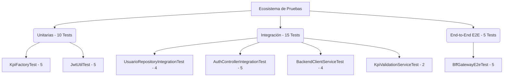

# 🧪 Guía de Pruebas de la Plataforma KPI (Grupo Cordillera)

Este documento contiene la descripción técnica de todas las pruebas unitarias, de integración y end-to-end (E2E) creadas en el proyecto, cubriendo los flujos críticos de la arquitectura distribuida.

---

## 📊 Resumen del Ecosistema de Pruebas

El sistema de pruebas está estructurado en 3 niveles de granularidad lógica, sumando **30 pruebas automatizadas**:



---

## 1. 🔍 Pruebas Unitarias (Unit Tests)
Estas pruebas evalúan componentes y algoritmos aislados en memoria, sin cargar el contexto de Spring Boot o requerir bases de datos o red activa.

### A. [`KpiFactoryTest.java`](file:///c:/Users/User/OneDrive/Documentos/Pixelium_Repo/cordillera/microservices/service-kpis/src/test/java/com/grupocordillera/kpis/factory/KpiFactoryTest.java) (Microservicio KPIs)
Valida la instanciación de entidades mediante el patrón de diseño **Factory Method**:
1. `testCreateFinancieroKpi`: Verifica que al solicitar el tipo `FINANCIERO` se instancie un `FinancieroKPI` con atributos correctos.
2. `testCreateCumplimientoKpi`: Verifica la instanciación de un `CumplimientoKPI`.
3. `testCreateOperacionalKpi`: Verifica la instanciación de un `OperacionalKPI`.
4. `testCreateKpiNullTypeThrowsException`: Valida el lanzamiento controlado de excepción ante un tipo nulo.
5. `testCreateKpiUnknownTypeThrowsException`: Comprueba el lanzamiento de excepción para tipos de KPI inexistentes (ej. `ECOLOGICO`).

### B. [`JwtUtilTest.java`](file:///c:/Users/User/OneDrive/Documentos/Pixelium_Repo/cordillera/bff-gateway/src/test/java/com/grupocordillera/bff/security/JwtUtilTest.java) (BFF Gateway)
Verifica las operaciones criptográficas del token JWT:
1. `testGenerateAndExtractToken`: Genera un token y verifica que se extraiga el usuario original de forma idéntica.
2. `testExtractRole`: Extrae el rol (`Claims`) codificado.
3. `testExtractAreaIdAndEquipoId`: Valida la extracción íntegra de metadatos de usuario (`areaId`, `equipoId`).
4. `testValidateTokenSuccess`: Comprueba la firma y validez de un token emitido.
5. `testValidateTokenFailure`: Deniega tokens alterados, expirados o con username discrepante.

---

## 🔌 2. Pruebas de Integración (Integration Tests)
Evalúan la comunicación de múltiples componentes acoplados, tales como acceso a bases de datos relacionales en memoria o deserialización de endpoints HTTP.

### A. [`UsuarioRepositoryIntegrationTest.java`](file:///c:/Users/User/OneDrive/Documentos/Pixelium_Repo/cordillera/microservices/service-areas/src/test/java/com/grupocordillera/areas/repository/UsuarioRepositoryIntegrationTest.java) (Microservicio Áreas)
Valida la capa de persistencia Hibernate/JPA contra base de datos **H2 en memoria**:
1. `testSaveAndFindUser`: Crea y recupera un usuario de base de datos validando sus campos.
2. `testUpdateUser`: Altera un usuario en la sesión y comprueba que los cambios se guarden en DB.
3. `testDeleteUser`: Remueve un registro y valida su ausencia física.
4. `testFindAllUsers`: Valida la consulta global y conteo de usuarios.

### B. [`AuthControllerIntegrationTest.java`](file:///c:/Users/User/OneDrive/Documentos/Pixelium_Repo/cordillera/bff-gateway/src/test/java/com/grupocordillera/bff/controller/AuthControllerIntegrationTest.java) (BFF Gateway)
Utiliza `MockMvc` para simular peticiones HTTP y mockea la comunicación REST con el microservicio de áreas:
1. `testLoginSuccess`: Login exitoso (retorna token JWT con código 200).
2. `testLoginIncorrectPassword`: Retorno de HTTP 401 por credencial incorrecta.
3. `testLoginUserNotFound`: Retorno de HTTP 401 por usuario no existente.
4. `testLoginAreasServiceUnavailable`: Retorno de HTTP 503 (Servicio no Disponible) cuando el BFF no puede comunicarse con `service-areas`.
5. `testLoginMissingFields`: Retorno de HTTP 400 por JSON incompleto.

### C. [`BackendClientServiceTest.java`](file:///c:/Users/User/OneDrive/Documentos/Pixelium_Repo/cordillera/bff-gateway/src/test/java/com/grupocordillera/bff/service/BackendClientServiceTest.java) y [`KpiValidationServiceTest.java`](file:///c:/Users/User/OneDrive/Documentos/Pixelium_Repo/cordillera/microservices/service-metas/src/test/java/com/grupocordillera/metas/service/KpiValidationServiceTest.java)
Valida la lógica de comunicación externa y los métodos **Fallback de Resilience4j (Circuit Breakers)** ante caídas simuladas.

---

## 🏆 3. Pruebas End-to-End (E2E Tests)
Simulan el ciclo de vida completo de un Request desde el exterior, pasando por filtros de seguridad JWT, interceptores de roles, controladores de agregación y mockeo de microservicios.

### A. [`BffGatewayE2eTest.java`](file:///c:/Users/User/OneDrive/Documentos/Pixelium_Repo/cordillera/bff-gateway/src/test/java/com/grupocordillera/bff/controller/BffGatewayE2eTest.java) (BFF Gateway)
Levanta un servidor web de pruebas para verificar el comportamiento global:
1. `testDashboardE2EAdminAccess`: Envía un token de administrador. Verifica que el BFF llame a todos los microservicios, calcule y sume el cumplimiento global en el reporte consolidado de metas sin restricciones.
2. `testDashboardE2ECollaboratorAccess`: Envía un token de Colaborador (asociado a un equipo específico). Comprueba que el payload devuelto por el BFF oculte la información de otros equipos, aplicando el filtrado jerárquico de forma exitosa.
3. `testDashboardE2EUnauthorized`: Envía peticiones sin cabecera o con firmas rotas. Asegura el bloqueo en la capa de seguridad (HTTP 401).
4. `testCreateMetaSuccess`: Envía un payload de creación de meta firmado por un Administrador. Valida que el BFF enrute y serialice la petición de forma adecuada hacia `service-metas` (HTTP 201).
5. `testCreateMetaForbidden`: Comprueba la seguridad RBAC. Un colaborador intenta crear una meta mediante POST y es rechazado de inmediato a nivel Gateway con un HTTP 403.

---

## 🚀 Cómo Ejecutar las Pruebas

Las pruebas han sido automatizadas utilizando **Maven**. Puedes ejecutarlas desde la terminal en la raíz del proyecto.

> [!NOTE]
> No es necesario que MySQL o Docker estén activos para ejecutar las pruebas, ya que todos los microservicios están configurados para usar bases de datos H2 en memoria y mockeo local durante el ciclo de pruebas.

### Ejecutar todas las pruebas del proyecto
```bash
mvn clean test
```

### Ejecutar las pruebas de un módulo específico

*   **Módulo BFF Gateway**:
    ```bash
    mvn -pl bff-gateway test
    ```
*   **Módulo Áreas y Equipos**:
    ```bash
    mvn -pl microservices/service-areas test
    ```
*   **Módulo KPIs**:
    ```bash
    mvn -pl microservices/service-kpis test
    ```
*   **Módulo Metas**:
    ```bash
    mvn -pl microservices/service-metas test
    ```

### Ejecutar una clase de prueba específica
```bash
mvn -pl bff-gateway test -Dtest=BffGatewayE2eTest
```

### Ver reportes detallados de ejecución
Una vez terminadas las pruebas, Maven genera reportes XML e informes en texto plano en la carpeta `target/surefire-reports` de cada módulo respectivo.
